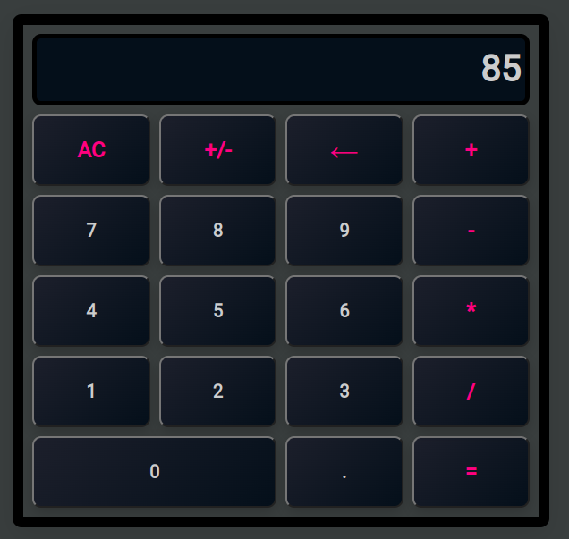

# Calculator Web Application

## Overview
This is a simple and clean calculator built using JavaScript. It features a clear, user-friendly interface that allows you to perform basic mathematical operations: addition, subtraction, multiplication, and division. It was designed with an emphasis on readability and clean code.

## Live Demo
Click [here](https://your-username.github.io/your-repo-name/) to see the live demo of the calculator.




## Code Highlights

### Calculator Class
The Calculator class encapsulates the functionality of the calculator. It stores the current and previous operands, as well as the chosen operation. This class also implements the logic for performing calculations and updating the operands.

```javascript
export default class Calculator {
    constructor() {
      this.clear();
    }
  
    //...
  
    calculate() {
      let computation;
      const prev = parseFloat(this.previousOperand);
      const current = parseFloat(this.currentOperand);
      if (isNaN(prev) || isNaN(current)) return;
      switch (this.operation) {
        case '+':
          computation = prev + current;
          break;
        //...
      }
      this.currentOperand = computation;
      this.operation = null;
      this.previousOperand = '';
    }
}
```

### Event Listeners
Event listeners are set up for each button on the calculator. These listeners call the appropriate methods on the Calculator instance when a button is clicked, and then update the display.

```javascript
numberButtons.forEach(button => {
  button.addEventListener('click', () => {
    calculator.appendNumber(button.innerText);
    display.innerText = calculator.getDisplayNumber(calculator.currentOperand);
  });
});
```

### Installation
1. Clone this repository.
2. Open 'index.html' in your web browser to use the calculator.

### Testing
This project uses Jest for unit testing. To test, first install Jest using npm and then run the test suite:
```bash
npm install
npm test
```

### Future Improvements
- Implement more complex mathematical operations.
- Add keyboard support for faster input.
- Improve error handling and display more detailed error messages.
